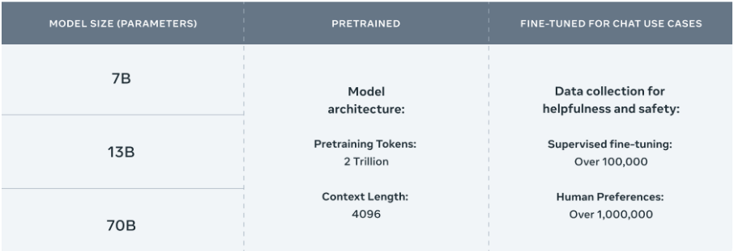

# Meta: Llama2

- Available models:
    - `Meta Llama2 7B`
    - `Meta Llama2 13B`
    - `Meta Llama2 70B`

- [Llama2 research paper](../../docs/doc/llama2_open_foundation_and_fine-tuned_chat_models/10000000_662098952474184_2584067087619170692_n.pdf)
- HuggingFace:
    - GGUF is a new format introduced by the llama.cpp team on August 21st 2023. It is a replacement for GGML, which is no longer supported by llama.cpp. GGUF offers numerous advantages over GGML, such as better tokenisation, and support for special tokens. It is also supports metadata, and is designed to be extensible.
        - [TheBloke/Llama-2-7B-Chat-GGUF](https://huggingface.co/TheBloke/Llama-2-7B-Chat-GGUF)
        - [TheBloke/Llama-2-7B-Chat-GGML](https://huggingface.co/TheBloke/Llama-2-7B-Chat-GGML)

- References:
    - [Llama2: open source, free for research and commercial use](https://llama.meta.com/llama2/)
    - [5 Steps to Getting Started with Llama 2](https://ai.meta.com/blog/5-steps-to-getting-started-with-llama-2/)
    - [Meta and Microsoft Introduce the Next Generation of Llama](https://about.fb.com/news/2023/07/llama-2/)
    - [Brief Introduction to Llama 2](https://medium.com/@florian_algo/brief-introduction-to-llama-2-cec2d59fc13f)
    - [End To End LLM Project Using LLAMA 2- Open Source LLM Model From Meta](https://www.youtube.com/watch?v=cMJWC-csdK4)