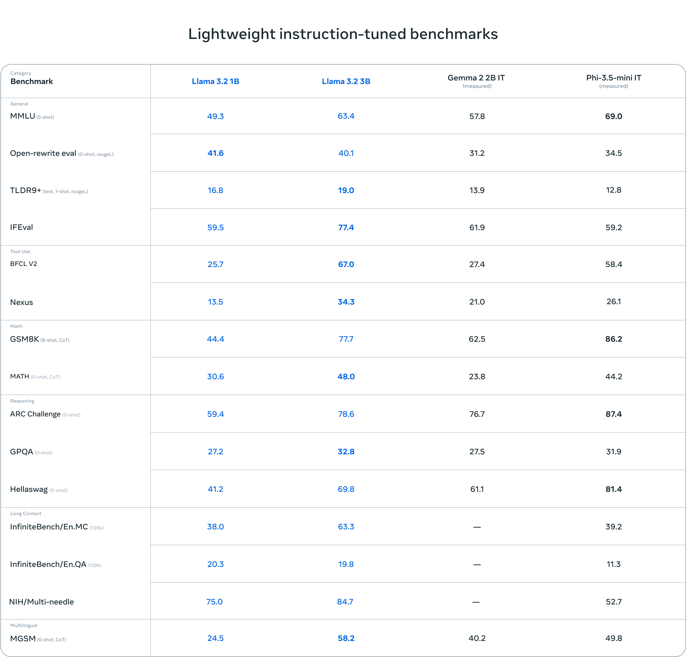

[ollama - llama3.2](https://ollama.com/library/llama3.2)
- Models:
    - llama3.2:1b - `ollama run llama3.2:1b`
    - llama3.2:3b - `ollama run llama3.2`    
- Benchmark

- Supported Languages:
    - English, German, French, Italian, Portuguese, Hindi, Spanish, and Thai are officially supported. Llama 3.2 has been trained on a broader collection of languages than these 8 supported languages.